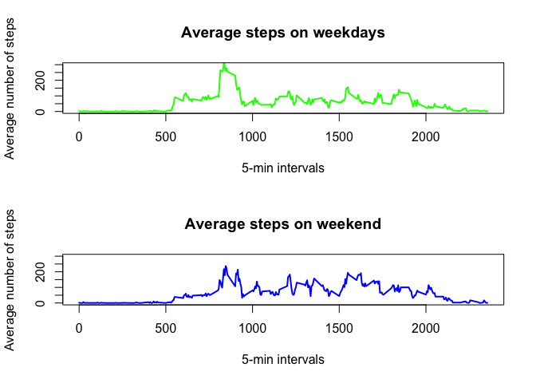

# Reproducible Research: Peer Assessment 1
Slim  
May 17, 2015  


## Loading and preprocessing the data
1. loading the data from the working dicrectory and taking care of the missing values

```r
activity <- read.csv("~/Desktop/CS stuff/5 - Reproducible Research/WD5/RepData_PeerAssessment1/activity.csv")
activity1 <- na.omit(activity)
```

## What is mean total number of steps taken per day?

2. Calculating the number of steps taken per day and showing the first 6 values

```r
library(dplyr)
```


```r
activity_bydate <- group_by(activity1, date)
sum_activity_bydate <- summarise(activity_bydate, steps_per_day = sum(steps))
head(sum_activity_bydate)
```

3. Plotting the distribution of total steps per day in a histogram

```r
hist(sum_activity_bydate$steps_per_day, breaks = 18, xlab = "Total number of steps per day", main = "Histogram of the total number of steps taken each day", col = "violet")
```

 

4. Calculating the median and mean of the total number of steps taken per day

```
##   mean_of_steps median_of_steps
## 1      10766.19           10765
```

## What is the average daily activity pattern?

5. Time series plot of average steps taken per day

```r
activity_byinter <- group_by(activity1, interval)
mean_activity_byinter  <- summarise(activity_byinter, steps_per_inter = mean(steps))

plot(y= mean_activity_byinter$steps_per_inter,  x = mean_activity_byinter$interval, type = "l", main = "The average of steps taken per 5-min interval", xlab = "Time by 5-min intervals", ylab = "Average of steps taken", col = "red", lwd = "2")
```

 

## Imputing missing values

6. Getting the number of NA's in the dataset

```r
sum(is.na(activity))
```

```
## [1] 2304
```

7. imputing the NA's with the average of each interval

```r
i<-1
for (i in 1:dim(activity_byinter)[1]){
        if (activity1[i,1] == "0"){
                r <- match(activity1[i,3],mean_activity_byinter$interval)
                activity1[i,1] <- mean_activity_byinter[r,2]
                }
        i=i+1
}       
```

8. Make a histogram of the new dataset (imputed NA's)

```r
activity1_steps <- group_by(activity1, date)
sum_activity1_steps  <- summarise(activity1_steps, sum_steps = sum(steps))
hist(sum_activity1_steps$sum_steps, breaks = 18, xlab = "Total number of steps per day", main = "Histogram of the total number of steps taken each day (imputed NAs)", col = "violet")
```

 
9. New mean and median for the imputed NAs dataset

```r
mean_activity1 <- summarise(sum_activity1_steps, mean_of_steps = mean(sum_steps))
median_activity1 <- summarise(sum_activity1_steps, median_of_steps = median(sum_steps))

cbind(mean_activity1, median_activity1)
```

```
##   mean_of_steps median_of_steps
## 1      16647.28        16763.81
```

## Are there differences in activity patterns between weekdays and weekends?
10. Creating a new factor variable in the dataset with two levels – “weekday” and “weekend” indicating whether a given date is a weekday or weekend day

```r
library(tidyr)
library(lubridate)
activity1 <- mutate(activity1, date_day=wday(date))
activity_wkday<-subset(activity1,date_day>1 & date_day<7)
activity_wkday <- transform(activity_wkday, interval = factor(interval))
activity_wkday<-group_by(activity_wkday,interval)
mean_steps_inter_wkday <- summarise(activity_wkday, steps = mean(steps,na.rm=TRUE))

activity_wkend <- subset(activity1,date_day==1 | date_day==7)
activity_wkend <- transform(activity_wkend, interval = factor(interval))
activity_wkend <- group_by(activity_wkend,interval)
mean_steps_inter_wkend <- summarise(activity_wkend, steps = mean(steps,na.rm=TRUE))
```

11. plotting the mean steps on weekdays Vs. weekend 

```r
par(mfrow = c(2, 1))
plot(levels(as.factor(mean_steps_inter_wkday$interval)), mean_steps_inter_wkday$steps, 
type="l", col="green", lwd=2, ylim=c(0,300),
main="Average steps on weekdays", 
xlab="5-min intervals", ylab="Average number of steps")

plot(levels(as.factor(mean_steps_inter_wkend$interval)), mean_steps_inter_wkend$steps, 
type="l", col="blue", lwd=2, ylim=c(0,300),
main="Average steps on weekend",
xlab="5-min intervals", ylab="Average number of steps")
```

 
